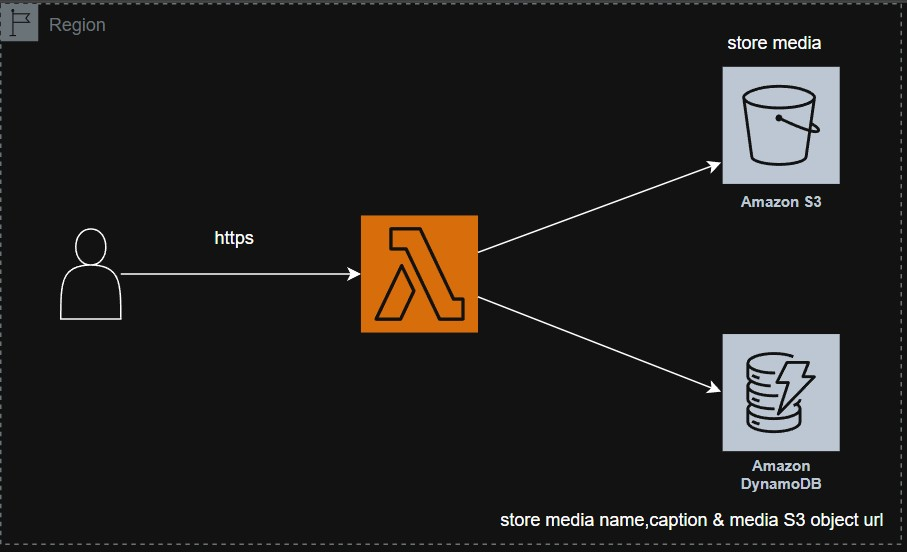
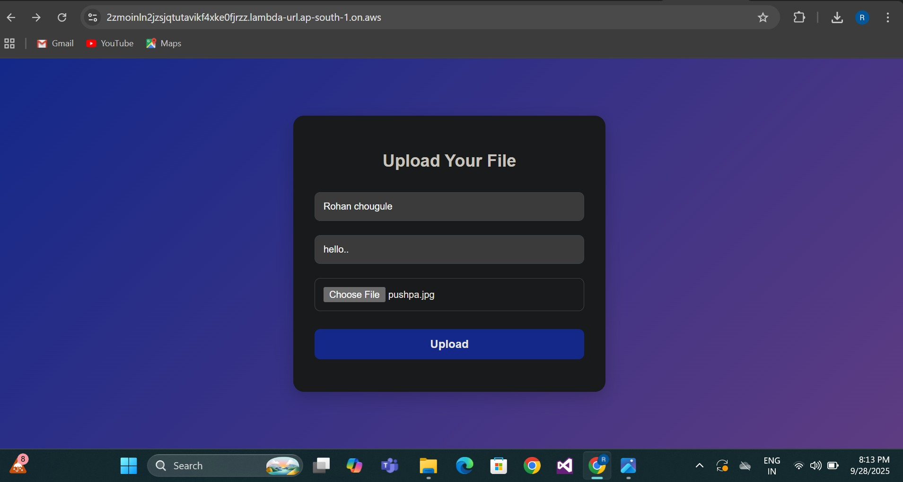
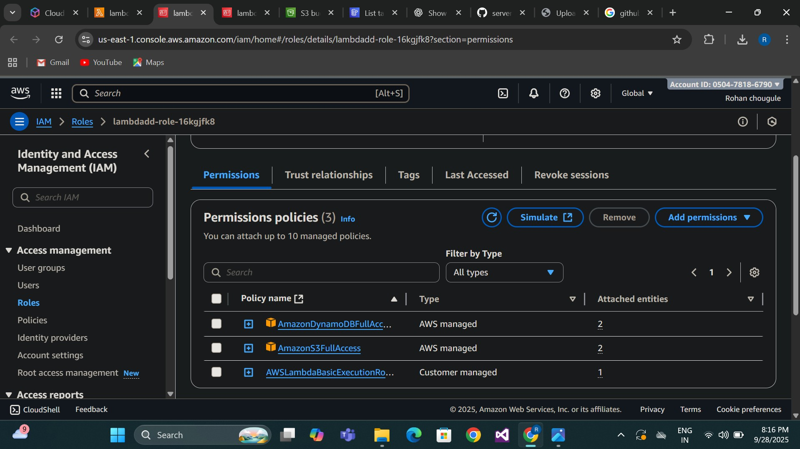
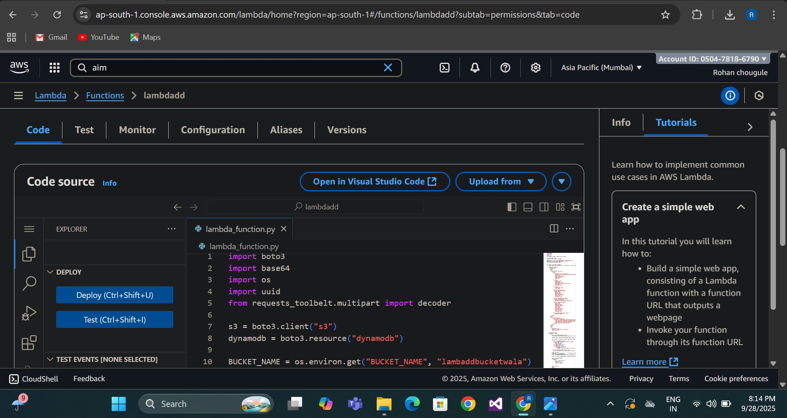
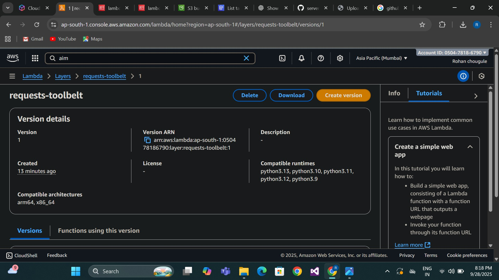
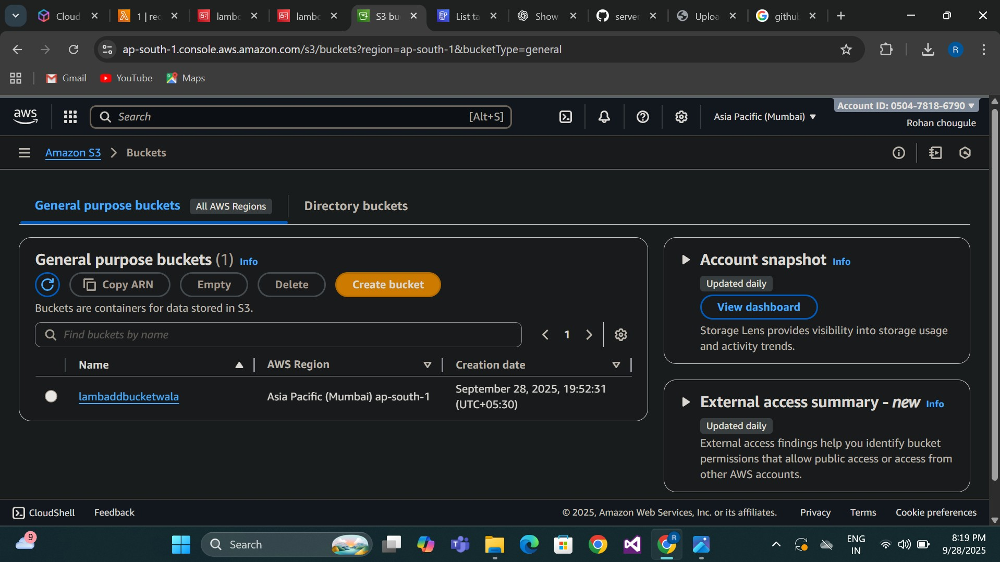
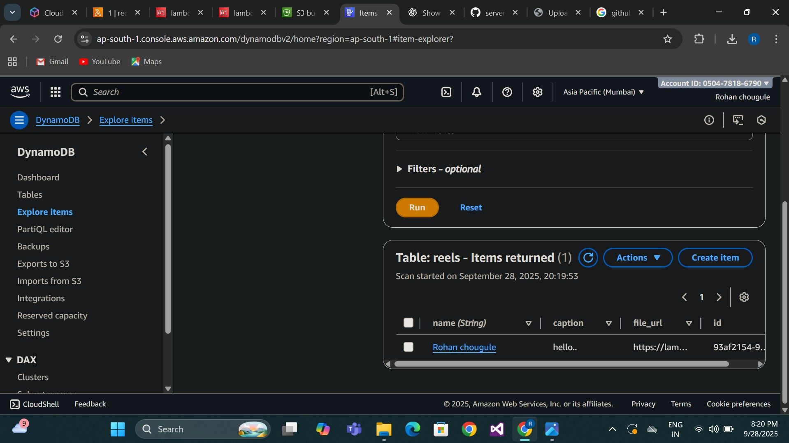
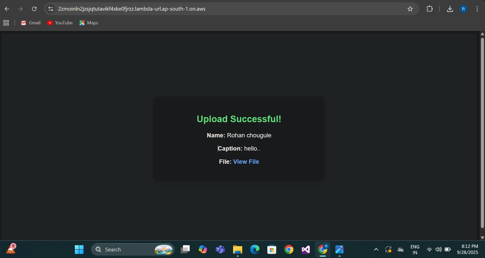

# AWS Lambda with S3 and DynamoDB
This project outlines a serverless media upload hub built using AWS Lambda, S3, and DynamoDB. It enables users to upload media files through a web interface, storing the files in S3 and their associated metadata in DynamoDB.
## Features
* **Serverless Backend:** Utilizes AWS Lambda for efficient and scalable processing without managing servers.
* **Object Storage:** Employs Amazon S3 for durable and highly available storage of media assets.
* **Data Management:** Uses Amazon DynamoDB for flexible and fast storage of media metadata.
* **User-Friendly Interface:** Provides a simple web form for media uploads.
## Project Architecture Diagram

## AWS Components and Purpose
<!DOCTYPE html>
<html>
<head>
    <title>AWS Components</title>
</head>
<body>
<h2></h2>

<table border="1" cellpadding="8">
    <tr>
        <th>Component</th>
        <th>AWS Service</th>
        <th>Description / Purpose</th>
    </tr>
    <tr>
        <td>🗂 File Storage</td>
        <td>Amazon S3</td>
        <td>Secure, scalable storage for user-uploaded files and static assets.</td>
    </tr>
    <tr>
        <td>⚡ Compute</td>
        <td>AWS Lambda</td>
        <td>Serverless backend for processing file uploads and triggering workflows automatically.</td>
    </tr>
    <tr>
        <td>📊 Database</td>
        <td>Amazon DynamoDB</td>
        <td>NoSQL database to store file metadata and user access details with high performance.</td>
    </tr>
    <tr>
        <td>🔐 Security</td>
        <td>AWS IAM Policies</td>
        <td>Manages permissions and access control for secure interactions between services.</td>
    </tr>
</table>

</body>
</html>

## Workflow Summary
1. **User Uploads a File →** Through an API endpoint.  
2. **API Gateway →** Routes request securely to AWS Lambda.  
3. **Lambda Function →** Validates, processes, and uploads file to Amazon S3.  
4. **DynamoDB →** Stores metadata like file name, timestamp, and user details.  
5. **Lambda →API Gateway → User →** Returns a success response with a download link.
---
## Project Walkthrough and Components

Here are the key aspects of the project, illustrated with screenshots:

---
### 1. Upload Interface
---
This image shows the web form used for uploading media, where users input a name, caption, and select a file.

---
### 2. IAM Role Permissions
Details of the IAM role permissions granted to the Lambda function, allowing it to interact with S3 and DynamoDB.

### 🚀 Step-by-Step Setup Guide
1. **Open AWS Console** → Navigate to IAM Service.
2. Click **Roles → Create Role.**  
3. **Choose Trusted Entity:** 
* **AWS Service** → Select **Lambda.** 
4. **Attach Managed Policies:**  
* `AWSLambdaBasicExecutionRole` (for logging)
* `AmazonS3FullAccess`(for S3 bucket operations) 
     
* `AmazonDynamoDBFullAccess` (for DynamoDB access)
* **Review and Create Role.**  
* Assign this role to your **Lambda function** under its configuration settings.
---
### 3. Lambda Function Code
---
A view of the Python code for the AWS Lambda function, which orchestrates the upload to S3 and data entry into DynamoDB.

---
### 4. Lambda Layer Configuration
---
The configuration for the mylayer Lambda layer, used for managing dependencies.

---
### 5. S3 Bucket Overview
---
The Amazon S3 bucket (lamdawithdynadb) where the media files are stored.

---
### 🚀 Step-by-Step Setup Guide

---

1. **Open AWS Console →** Navigate to S3 Service.   
2. **Click “Create Bucket”.**  
3. **Enter the Bucket Name:**
   * `majisimpleb`    
4. **Select Region:**  
   * `us-east-1 (Asia Pacific - Mumbai)`        
5. Uncheck **"Block All Public Access"** (*if using pre-signed URLs*).   
6. **Enable Bucket Versioning** (*recommended for file recovery*).  
7. Click **Create Bucket** to finalize.
8 Configure **Bucket Policies** and **IAM Roles** to restrict access.

---
### 6. DynamoDB Table Entries

---
The reels DynamoDB table displaying the metadata for uploaded items, including id, caption, file_url, and name.

---
### 🚀 Step-by-Step Setup Guide
---
1. **Open AWS Console →**    Navigate to **DynamoDB** Service.             
2. Click **Create Table.**    
3. **Configure basic settings:**    
   * **Table Name:** `lambda`
   * **Partition Key:** `id(String)`   
4. Under **Capacity Mode**, select **On-Demand**.
5. Enable **Encryption** using **AWS Managed Key (KMS)**.     
6. (Optional) Turn on **Point-in-Time Recovery** for backups.
7. Click **Create Table** to finalize.

---
### 7. Successful Upload Confirmation

---
The confirmation message displayed on the web interface after a successful media upload, showing the stored details and file URL.

---
## 🔐 8. Security Features
Ensuring data privacy, controlled access, and system reliability through AWS security best practices.

---
### 8.1 Access Control
<!DOCTYPE html>
<html>
<head>
    <title>AWS Security Controls</title>
</head>
<body>
<h2></h2>

<table border="1" cellpadding="8">
    <tr>
        <th>Control</th>
        <th>Implementation</th>
    </tr>
    <tr>
        <td>🧑‍💻 IAM Roles</td>
        <td>Least privilege permissions for Lambda.</td>
    </tr>
    <tr>
        <td>🚫 No Public S3 Access</td>
        <td>Bucket is private by default.</td>
    </tr>
    <tr>
        <td>🗂 Granular DynamoDB Policies</td>
        <td>Fine-grained access controls on metadata.</td>
    </tr>
</table>

</body>
</html>

---
### 8.2 Data Protection
<!DOCTYPE html>
<html>
<head>
    <title>AWS Features and Benefits</title>
</head>
<body>

<h2></h2>

<table border="1" cellpadding="8">
    <tr>
        <th>Feature</th>
        <th>Benefit</th>
    </tr>
    <tr>
        <td>⏳ Temporary URLs</td>
        <td>Secure, time-limited access to files.</td>
    </tr>
    <tr>
        <td>🔒 No Persistent Public Links</td>
        <td>Prevents permanent exposure of data.</td>
    </tr>
    <tr>
        <td>🗄 Secure Metadata Storage</td>
        <td>Sensitive metadata stored safely in DynamoDB.</td>
    </tr>
</table>

</body>
</html>

---

### 8.3 Monitoring & Logging

<!DOCTYPE html>
<html>
<head>
    <title>AWS Logging</title>
</head>
<body>

<h2></h2>

<table border="1" cellpadding="8">
    <tr>
        <th>Service</th>
        <th>Logging Purpose</th>
    </tr>
    <tr>
        <td>📂 S3 Access Logs</td>
        <td>Records all file access activities.</td>
    </tr>
    <tr>
        <td>🔍 DynamoDB Logs</td>
        <td>Monitors query and data access patterns.</td>
    </tr>
</table>

</body>
</html>

---
### 💰 Cost Optimization
---
* **Pay-per-use Pricing:** Only pay for actual service usage.  
* **Serverless Architecture:** No idle resource costs.   
* **Automatic Scaling:** Handles varying workloads seamlessly.  
* **Zero Maintenance:** No need to manage servers or infrastructure.

---
### 📝 Project Summary
---
The Serverless Info Uploader is a secure, scalable, and fully serverless file upload solution built on AWS. It showcases modern cloud architecture patterns, including: 

* **Event-driven processing:** AWS Lambda handles uploads automatically.   
* **Managed services:** S3 for storage and DynamoDB for metadata ensure reliability.  
* **Secure access:** IAM policies enforce least-privilege access.  
* **Cost-efficiency:** Pay-per-use model with automatic scaling.  

By combining S3, Lambda, DynamoDB, and IAM, this solution provides a highly available, maintainable, and secure file upload service without server management.

Best Practices Implemented:

* Proper security configurations.  
* Error handling.
* Cost optimization.
* Seamless user experience for secure file sharing.